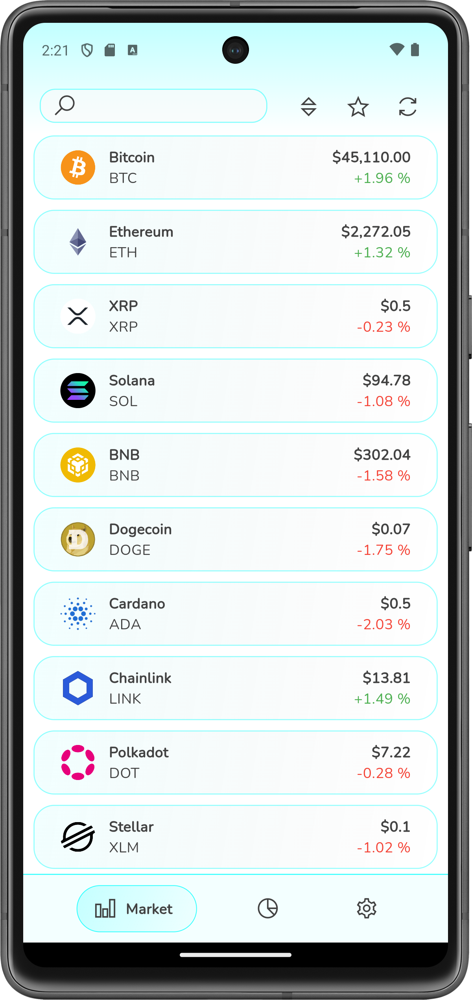
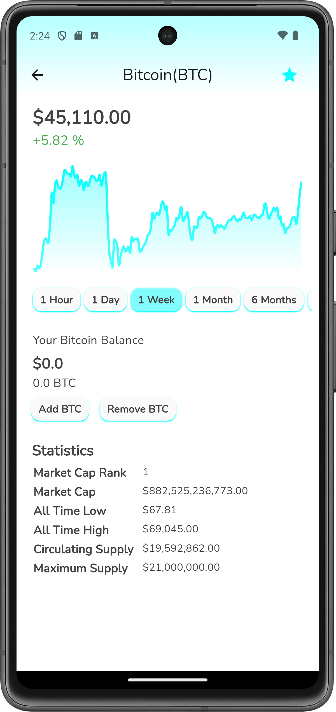
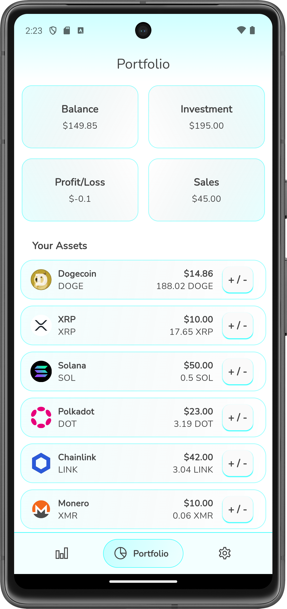
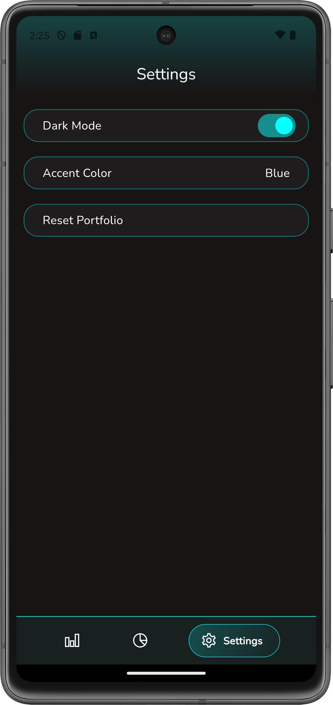

## CryptoBuddy

CryptoBuddy provides current data of popular digital currencies
and allows users to build their own portfolios.\
Data is fetched via the [CoinGecko API](https://www.coingecko.com/en/api) 
using the [coingecko_api](https://pub.dev/packages/coingecko_api) wrapper.\
Developed by Steven Schmitt(2025448@stud.hs-mannheim.de).

<p>
  
  
  
</p>

<p>
  
  
  
</p>

---

### Supported platforms

- **Android**
- **Linux**
- **Windows**

---

### Installation

- Install Flutter and Git
- Clone the repo: ```git clone https://gitty.informatik.hs-mannheim.de/2025448/CryptoBuddy.git```
- Fetch necessary dependencies inside the downloaded folder: ```flutter pub get```
- Run the app: ```flutter run -d os```, where ```os``` &isin; {linux, windows, android}\
The UI is primarily designed for android. For android, use Android Studio and either connect a physical device or
set up an emulator.

---

### Features

- **Cryptocurrency Listing**: List of 200 cryptocurrencies displaying information such as
    the current price, price change percentage, name and ticker.
- **Search Bar**: Effortlessly search through the list of cryptocurrencies 
    to quickly find and view details about a specific coin.
- **Refresh Button**: Users can refresh the data of all coins every 60 seconds.
- **Sorting Options**: Sort the cryptocurrency list based on various criteria, such as market cap,
    current price, or price change percentage making it easier to analyze and compare different cryptocurrencies.
- **Individual Currency Pages**: Upon selecting a specific cryptocurrency from the list, users
    are directed to a dedicated page displaying extensive information about the coin.
- **Price Development Charts**: Line charts settable from one hour to one year displaying the price change.
- **Favorites Selection**: Add specific coins to your list of favorites and
  filter the list with all currencies for quick access.
- **Portfolio building**: Buy and sell cryptocurrencies from your portfolio at will. The portfolio page provides 
Adding and removing can be done via the detailed coin page or on the portfolio page itself.
Additionally, the data in the portfolio is persistent.
- **Customizable UI**: Access to light and dark mode and customizable accent colors.
---

### APIs

**CoinGecko**\
This app makes use of the free Demo(Beta) plan. Plans can be viewed [here](https://www.coingecko.com/en/api/pricing). <br>
Max Coins per API call: 200\
Max API calls per month: 10.000\
Max API calls per minute: 30\
Data freshness: 60 seconds

---

### Tests

To run all tests, run `flutter test [-r expanded]` from the root directory of your project.